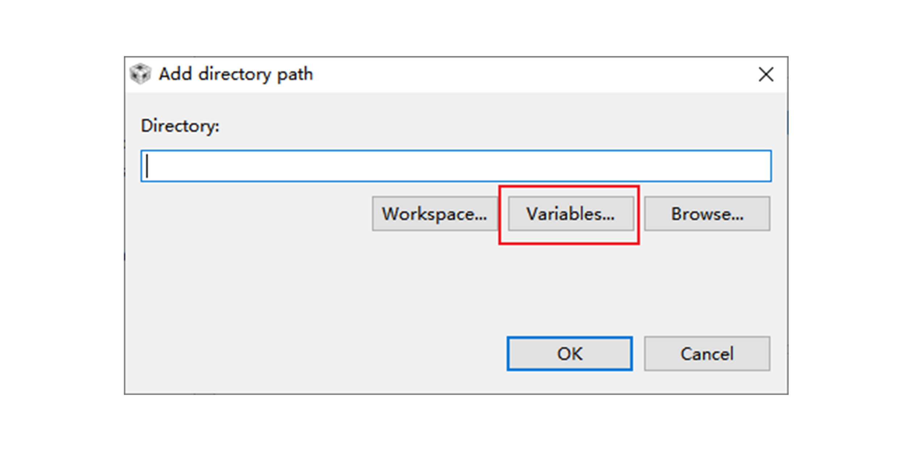
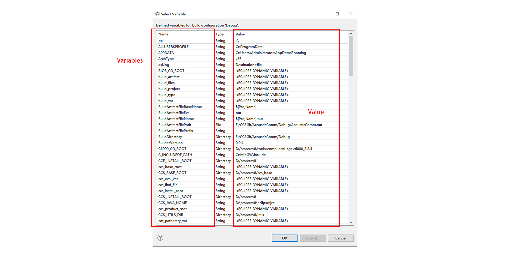
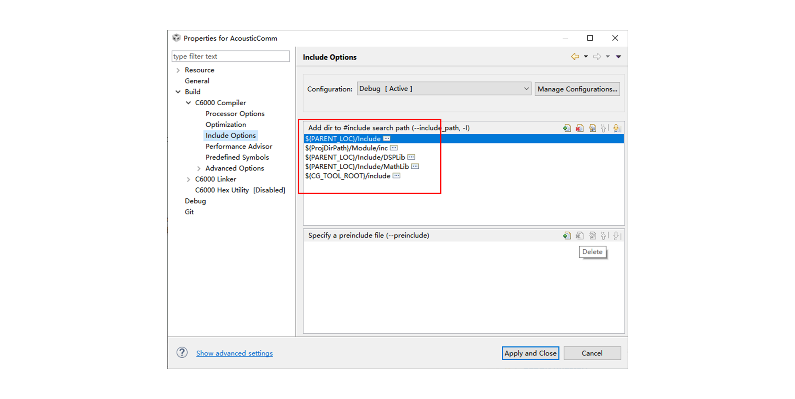
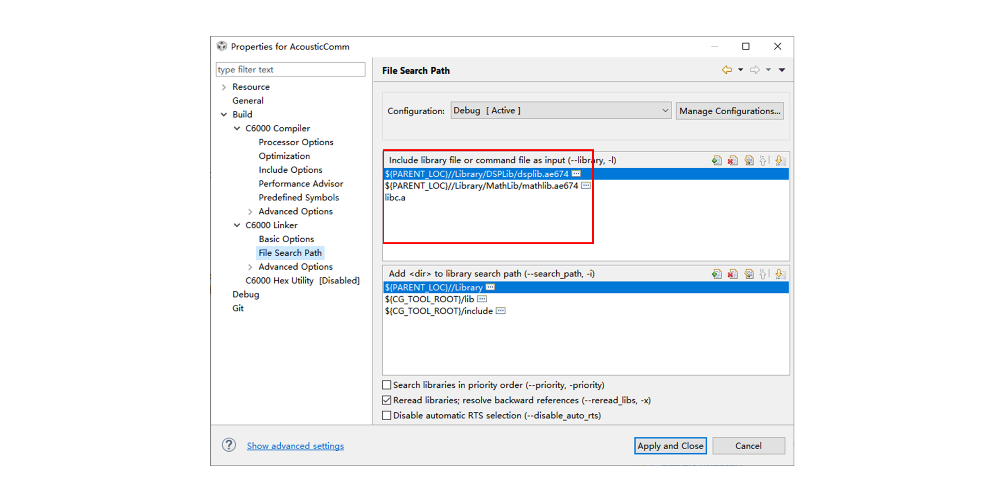
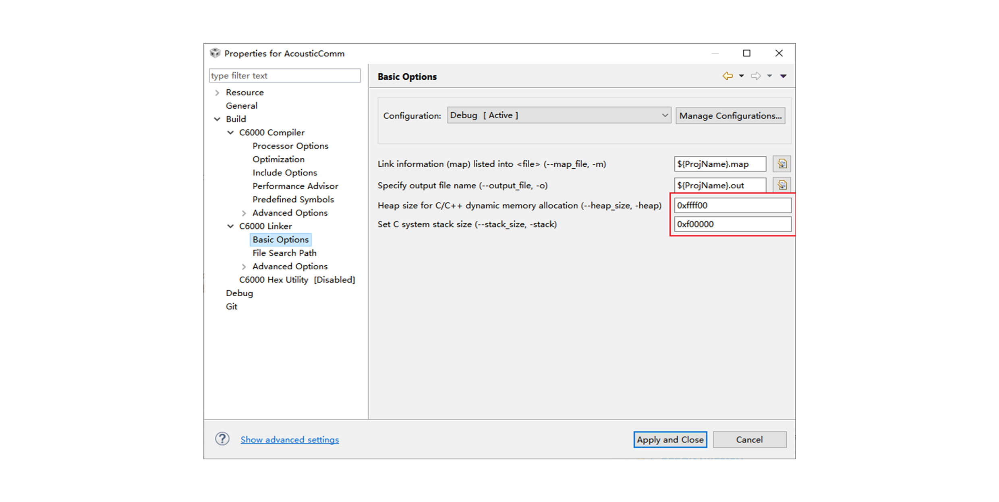

#  CCS移植工程

##  前言

在DSP开发过程中，难免需要移植来源为其他的工程，CCS再倒入一个工程的时候默认不会将该工程拷贝到工程文件夹下，但是示例程序很多的情况或者需要新建一个工程的时候，要解决该参考工程下的依赖往往会比较麻烦。

CCS在创建新工程之后，可以将参考工程中的各类源文件直接拷贝到新建立的工程中，这个时候编译不一定能够成功，尤其是参考工程中包含外部的库文件的时候。

## 移植

为了保证移植成功或者保证别人在移植自己的程序的时候能够将麻烦降到最低，一般按照如下步骤进行：

**1 Include Options** 

在Project Explore中对项目右键，选择Properties，或者快捷键Alt+Enter。在Build ---> C6000 Compiler ---> Include Options中添加Include路径，需要注意的是，虽然可以通过添加绝对路径引入include路径，但是这种方式并不利于团队协作或者移植工程，为此，CCS提供了Variables选项，将通用部分转化为变量，由CCS自动确定，用户只需要放入绝对路径即可。

需要额外注意的是，因为' \ '通常做转义符使用，因此路径中的分隔符一般使用' / '。

**2 File Search Path** 

ti的库不尽然是C语言写就，或者能够提供源代码，因此个别库需要额外再添加到文件搜索路径中去，具体见Build --> C6000 Linker --> File Search Path，注意事项同上

 

**3 Basic Option**

DSP不同于电脑，有系统可以帮助管理内存，开发DSP过程中有时候会遇到程序运行不正常的情况，具体表现可能有运算错误，错误崩溃，运行不停止等，在考虑修改cmd文件之前，可以在Build --> C6000 Linker --> Basic Option中尝试修改heap和stack的大小，尤其是stack，用于存放各种临时变量，当程序中包含了很多大数组或者复杂运算时，稍微调高stack的大小可以使得程序运行不会出现奇怪的错误。

